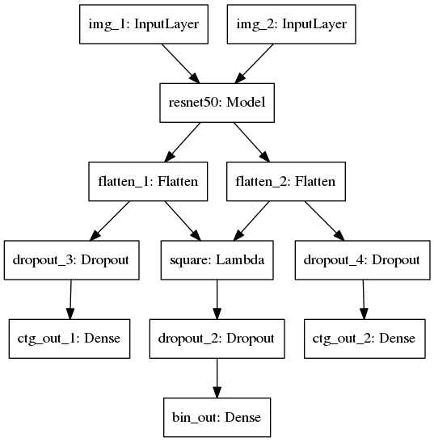
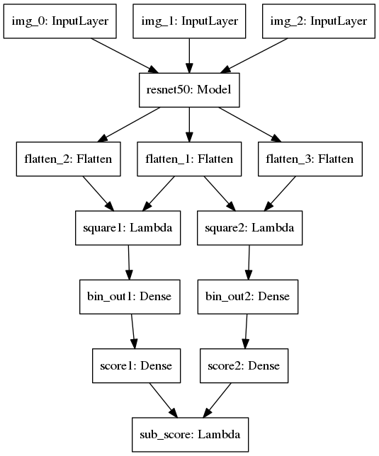

## Rank Re-identification

### Introduction
- Implement [Siamese network](pretrain/pair_train.py) proposed by [Zhedong](https://github.com/layumi/2016_person_re-ID) in Keras
- Using [RankNet](transfer/simple_rank_transfer.py) to regress ranking probability
### Enviroment
python2.7, tensorflow 1.4 and keras 2.1.5

### Model
#### Siamese Network


### What's new
- Refer to [Zhedong's pytorch baseline](https://github.com/layumi/Person_reID_baseline_pytorch), we write a memory-friendly [evaluation script](https://github.com/ahangchen/rank-reid/blob/master/baseline/eval_on_result.py), when you generate ranking id tables, for example named with 'market_rank_pid.txt', you can use `python3 eval_on_result.py --target_dataset_path /home/cwh/coding/dataset/market --pid_path market_rank_pid.txt --result_path market_result.log` to compute map and rank1, rank5, rank10. （test on python3, pytorch 0.4.0）

#### RankNet


- Base Network：ResNet50
- Input：Given a ranking list, choose a probe image A, two gallery image B, C
- Output：Compute the probability that rank AB > rank AC

### Hardware
- NVIDIA TITANX 11G
- Memory: >=16G

### Data prepare
#### Download
 - [CUHK01](http://www.ee.cuhk.edu.hk/~xgwang/CUHK_identification.html)
 - [VIPeR](https://vision.soe.ucsc.edu/node/178)
 - [Market-1501](http://www.liangzheng.org/Project/project_reid.html)
 - [GRID](http://personal.ie.cuhk.edu.hk/~ccloy/downloads_qmul_underground_reid.html)

#### Preprocess
Take Market-1501 as an example:
 - download
 - rename training directory to 'train', rename probe directory to 'probe', renmae gallery directory to 'test'

Your data directory will look like this:

```bash
Market-1501
├── probe
│   ├── 0003_c1s6_015971_00.jpg
│   ├── 0003_c3s3_064744_00.jpg
│   ├── 0003_c4s6_015641_00.jpg
│   ├── 0003_c5s3_065187_00.jpg
│   └── 0003_c6s3_088392_00.jpg
├── test
│   ├── 0003_c1s6_015971_02.jpg
│   ├── 0003_c1s6_015996_02.jpg
│   ├── 0003_c4s6_015716_03.jpg
│   ├── 0003_c5s3_065187_01.jpg
│   ├── 0003_c6s3_088392_04.jpg
│   └── 0003_c6s3_088442_04.jpg
└── train
    ├── 0002_c1s1_000451_03.jpg
    ├── 0002_c1s1_000551_01.jpg
    ├── 0002_c1s1_000776_01.jpg
    ├── 0002_c1s1_000801_01.jpg
    ├── 0002_c1s1_069056_02.jpg
    └── 0002_c6s1_073451_02.jpg

```

- replace all paths containing '/home/cwh/coding' to your data path in these file:
  - [baseline/train.py](baseline/train.py)
  - [pretrain/eval.py](pretrain/eval.py)
  - [pretrain/pair_train.py](pretrain/pair_train.py)
  - [transfer/simple_rank_transfer.py](transfer/simple_rank_transfer.py)


### Execution
- Train a Resnet-based softmax classifer: specify source dataset and run [baseline/train.py](baseline/train.py)
- Train a siamese network: specify source dataset and run [pretrain/pair_train.py](pretrain/pair_train.py)
- Train a RankNet: refer to [TFusion](https://github.com/ahangchen/TFusion)

### Detail Instruction
- baseline：ResNet52 base network
  - [evaluate.py](baseline/evaluate.py)
    - `extract_feature`: compute ranking result by base network and evaluate rank accuracy + mAP
    - `similarity_matrix`: Cosine similarity of CNN features(accelerated by GPU)
    - On test set, compute ranking table with `test_predict`
    - On training set，compute ranking table with `train_predict`
    - Compute rank accuracy and mAP with `map_rank_quick_eval` on Market1501(can be extended to DukeMTMC4ReID)
    - Compute rank accuracy with `grid_result_eval` on GRID
  - [train.py](baseline/train.py)
    - Use source dataset to pretrain ResNet52 base network
- pair: pretrain siamese network
  - [pair_train.py](pair/pair_train.py)：pretrain with two input images
    - pair_generator: data generator, selecting positive and negative samples according to person id
    - pair_model: build a Keras based Siamese network
  - [eval](pretrian/eval.py)：evaluate on Siamese Network and ranknet
    - load corresponding model
    - call function in baseline/evaluate.py for test

- transfer: incremental training with ranking table
  - [simple_rank_transfer.py](transfer/pair_transfer.py): learning to rank with three input images
    - triplet_generator_by_rank_list：image generator
    - rank_transfer_model：three input image, one ranking loss


#### Reference

- [RankNet](https://icml.cc/2015/wp-content/uploads/2015/06/icml_ranking.pdf)


## Citation

Please cite this paper in your publications if it helps your research:

```
@article{
  title={Unsupervised Cross-dataset Person Re-identification by Transfer Learning of Spatial-Temporal Patterns},
  author={Jianming, Lv and Weihang, Chen and Qing, Li and Can, Yang},
  journal={CVPR},
  year={2018}
}
```

## Credit
Credit to [ahangchen](https://github.com/ahangchen/rank-reid.git)
